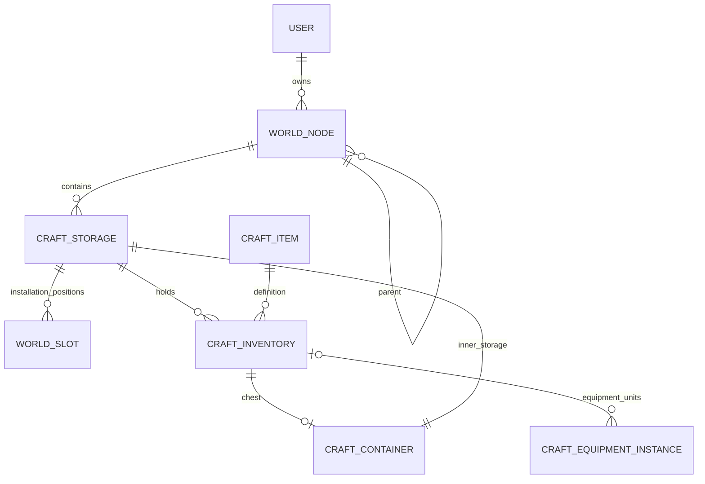

# БД мира, хранения, экономики и развития

Дата: 2026-09-26. Обновлено: 2026-09-27. Статус: созданы десять отдельных миграций в `yii2/console/world-migrations`, включая счета/кошелёк, финансового родителя, казну/обязательства, начальные заказы и расход бюджета. Schema marker — 10. Миграции не применялись, проверки не выполнялись по поручению владельца.

`[x]` означает готовый код миграции/сервиса, а не подтверждённую приёмку на БД. [Состояние и порядок продолжения](../world-implementation.md).

Обновление экономики: F1–F3/J1–J3 частично — подготовлены счета/ledger/вложения, родители/правила, receipts/loss, обязательства/резервы, заказы/исполнения и распределение расхода по funding lots. Additive-миграции сами не меняют credit-колонки; перенос/активация не запускались, `wallet_ready=0` по умолчанию. Подключение покупок, смена родителя, улучшения охраны и приёмка остаются впереди. [Текущее состояние](../world-orders-implementation.md).

Частично: A1–A3 — команды есть, реальные отчёты/baseline ещё не снимались; A4 — флаги, marker и отдельный допуск по сверке написаны, запуск отложен; B3 — construction/audit schema, без строительных команд; C6 — код канонического чтения и перехода готов; C7 — проверки на копиях двух СУБД не выполнялись; I4 — текущее состояние износа без полного журнала интервалов; E1 — только player actor. [Переход хранения](../world-storage-rollout.md). Прямое включение storage_v2/economy_tick запрещено; для хранения добавлен отдельный путь активации.

## Цель и контекст

Расширить существующие `user/persone/craft_*` так, чтобы один предмет мог находиться в рюкзаке, сундуке или постройке, а экономика и развитие опирались на сохраняемые проверяемые операции. Сохранить все текущие ID, предметы, опыт, балансы, историю и ключи повторов. Базовые решения: [архитектура](../world-architecture.md), [контракт](../world-api.md). Связанные планы: [BE](2026-09-26-world-backend.md), [FE](../../../frontend/docs/plan/2026-09-26-world-frontend.md).

Префикс `DB:` в других документах означает задачу этого плана. Новые имена таблиц предварительные, но их ответственность, ключи и ограничения обязательны. Текстовые `code` переносимы между средами, числовые ID — внутренние. PostgreSQL и MySQL остаются поддерживаемыми. SQLite подходит для чистых сценариев, но не доказывает блокировки и работу целевых FK.

Дополнение: [ночлег, улица, бюджеты/казна и грядки](../world-gameplay-economy.md). E1, F1–F3 и новые I–J требуются уже для S1; только выращивание/полное производство J6 подключается в S2. В обоих счетах Cr, но роли различны: collect treasury→свой budget; отчисление budget→treasury родителя. Данные сроков поступлений необходимы для разграбления несобранной казны.

## Целевая схема S1

| Таблица | Основные поля | Ключи, индексы, ограничения |
|---|---|---|
| `world_node` | id, parent_id, root_id, node_type, name, slug, owner_user_id?, visibility, status, depth, position_x/y, revision, created_at/updated_at | PK id; FK parent/root→self, owner→user; INDEX(parent_id,status,id), (root_id,node_type,status,id), (owner_user_id,id); UNIQUE(parent_id,slug). Единственность опубликованного стартового мира проверяется registry и транзакцией, не nullable UNIQUE корня. |
| `world_registry` | id=1, active_world_id, content_revision, world_enabled | Одна строка, блокируется при публикации/смене корня; feature gate не заменяет проверку прав. |
| `world_node_closure` | ancestor_id, descendant_id, distance | PK(ancestor_id,descendant_id), INDEX(descendant_id,distance); FK обе стороны→node; self row distance=0. Перенос меняет closure и parent атомарно. |
| `world_region`, `world_settlement` | node_id PK/FK, климат/инфраструктура; вид поселения, лимит участков, aggregate population | Типизированные поля, не дублировать name/parent/owner. Население — отдельный агрегат, не число аккаунтов. |
| `world_building` | node_id PK/FK, template_revision_id, level, condition/max_condition, operational_status, revision | Статус стройки/работы отделён от видимости узла; индекс status; уровни/прочность в допустимом диапазоне. |
| `world_room`, `world_plot`, `world_bed` | node_id PK/FK, template_revision_id; площадь/тип/состояние; у plot плодородие, у bed garden_node_id, ordinal, lock status | Грядка — BED-ребёнок огорода; UNIQUE(garden_node_id,ordinal), ordinal 1–10. Первая открыта, остальные требуют purchase entitlement; parent совпадает с garden ID. |
| `world_template`, `world_template_revision` | code, kind; template_id, version, status, typed config_json, author, published_at | UNIQUE(code), UNIQUE(template_id,version). Опубликованная revision неизменяема. Индексируемые свойства вынесены в обычные поля/связи. |
| `world_construction` | id, node_id, owner_user_id, template_revision_id, status, started_at, finish_at, paused_at, operation_id, revision | Один действующий проект на узел через отдельный active_project_id или guard-row; переносимый способ без partial UNIQUE. Стоимость/выданный результат фиксируются в операции/резервах. |
| `craft_storage` | id, kind, identity_key, owner_user_id?, node_id?, container_inventory_id?, actor_id?, capacity, revision, status | UNIQUE(identity_key), UNIQUE(container_inventory_id); FK node/user/container; INDEX(owner_user_id,kind,id), (node_id,kind,id). Для backpack identity=`backpack:user:<id>`, chest=`chest:item:<id>`, placement=`placement:node:<id>`, stockpile содержит роль input/output. |
| `craft_inventory` (расширение) | существующий id/item_id/item_quantity; storage_id, slot, revision | FK storage/item; INDEX(storage_id,item_id,id), UNIQUE(storage_id,slot). Исторические пустые строки получают slot=NULL; occupied имеет positive quantity и position. Старые user_id/container_id — временная проекция, не второй writer. |
| `world_slot` | storage_id, position, code, slot_type, size, compatibility_rule_revision_id, status | PK(storage_id,position), UNIQUE(storage_id,code); FK storage; существует только для placement. Соединение с inventory по (storage_id,slot) даёт установленный предмет. |
| `craft_equipment_instance` | id PK, inventory_id? FK, item_id FK, purpose equipment/shelter, status, durability, max_durability, quality, revision | INDEX(inventory_id,status,id); число активных единиц tool/station/shelter согласовано с quantity. В placement qty=1; stack_size прежнего оборудования сохраняется. Shelter единичен; его активная building-проекция имеет UNIQUE FK на instance и не дублирует владение/прочность. |
| `craft_container` (сохранение) | id=inventory.id, user_id, capacity, durability/max_durability | Добавить проверенные FK после аудита сирот; UNIQUE связь с chest storage. Владелец проверяется относительно канонического storage, независимо от положения сундука. |
| `game_command` | id, user_id, request_key, command_type, contract_version, fingerprint, result_json, created_at | UNIQUE(user_id,request_key); INDEX(created_at). Существующий craft_command не удалять и не переписывать. |
| `game_outbox`, `game_inbox` | event_id/type/version, aggregate_id/revision, payload, available_at; consumer,event_id,processed_at | Уникальный event ID; INDEX(status,available_at,id); inbox PK(consumer,event_id). Доставка и обработка могут повторяться. |
| `game_job` | id, type, business_key, payload, status, available_at, lease_until, fencing_token, attempts, last_error_code | UNIQUE(type,business_key), INDEX(status,available_at,id). Token меняется при claim; результат принимается только от текущей lease. |
| `game_operation`, `inventory_movement` | operation id/type/actor/time; item_id, inventory_id, source_storage?, destination_storage?, quantity, reason | FK на операцию, индекс inventory/operation/owner/time. Источник/назначение NULL только для явно обозначенной выдачи/расхода, не для переноса. |
| `world_audit` | id, actor_user_id, target, action, before_json, after_json, reason, operation_id, created_at | Append-only на прикладном уровне; INDEX(target,id), (actor_user_id,id). Финансовый ledger не заменяется аудитом. |

### Важные инварианты хранения

1. Одна inventory row находится ровно в одном storage. Установка — смена storage и позиции, а не insert дубликата предмета.
2. Для occupied rows уникален `(storage_id,slot)`. Пустые исторические rows не занимают позицию; переполнение получает отдельные позиции сверх active capacity, не удаляется.
3. Владение определяется storage и владельцем объекта/сундука. На S1 все перемещаемые вещи принадлежат игроку; доступ к чужому предмету не следует из права просмотра node. При S2 системные/NPC хранилища допускают nullable user и проверяются типом владельца.
4. Для каждого сундука одна placement-independent строка `craft_container` и одно chest storage. Смена места сундука не меняет внутреннее storage. Сундук никогда не лежит в chest storage.
5. FK storage.container_inventory_id→inventory и inventory.storage_id→storage создают технический цикл ссылок, но не игровой цикл хранения. Таблицы сначала создаются с nullable ссылками, затем backfill и FK; MySQL не требует deferred constraints.
6. Внутреннее storage сундука наследует право владельца через сундук. Пока передачи собственности нет, оно не может иметь другого owner. Будущая передача обновляет весь набор под одной транзакцией.
7. В placement одна позиция соответствует world_slot, предмет совместим и qty=1. Это межтабличное правило проверяется под lock; переносимость не основывается на CHECK с подзапросами.
8. Item definition не удаляется, пока есть остатки/история; архивирование заменяет CASCADE. Узлы с вещами также не удаляются каскадно.
9. Прочность сундука имеет один источник в craft_container; прочность станции/инструмента — в equipment_instance. Количество активных экземпляров согласовано с количеством единиц в стопках. Метаданные представления не хранят независимую копию.
10. Прямые административные/старые inventory writers должны использовать единый storage writer до активации размещения. Иначе `container_id=NULL` ошибочно сделает станцию здания расходуемым предметом рюкзака.

## Схема развития: ранний Actor/деньги S1, остальное S2–S3

| Группа | Таблицы и назначение | Обязательные ключи/инварианты |
|---|---|---|
| Actor и NPC | `game_actor(id,kind,user_id?)`; `npc(actor_id,template_revision_id,owner_user_id?,home_node_id?,status,revision)` | UNIQUE actor.user_id; player требует user, NPC не имеет логина. NPC detail PK/FK actor_id. Удаление аккаунта архивирует/освобождает активы по политике, не каскадно уничтожает мир. |
| Профессии | `profession`, `profession_level`, `actor_profession`, `progression_award`, `actor_achievement`, `requirement_set/revision` | UNIQUE(code), (profession_id,level), (actor_id,profession_id), (source_event_id,actor_id,track_code). Накопленный craft_skill остаётся источником ремесленного XP игрока. |
| Работа | `world_job_position`, `npc_assignment`, `npc_training` | Позиция→building, профессия/уровень/зарплата; отдельная `npc_active_assignment(actor_id PK,assignment_id UNIQUE)` обеспечивает один активный пост без partial index. История назначений не теряется. |
| Производство | `production_order`, `inventory_reservation`, `equipment_reservation` | Order фиксирует recipe/rules revision, исполнителя, источник и выход; UNIQUE business completion key. Для item суммарный активный reserve≤quantity под lock. Отдельная equipment guard-row запрещает одновременное использование экземпляра. |
| Время | `world_tick`, `world_tick_task`, `world_tick_snapshot`, `world_period_state` | UNIQUE(world_id,sequence), UNIQUE(tick_id,node_id,task_type), UNIQUE(node_id,tick_id) для состояния начала периода; effective_from_tick и settled_through_tick запрещают перерасчёт прошлого по текущим данным. Итоговый снимок публикуется только после полного набора задач. |
| Счета | `economy_subject`, `economy_account`, `economy_operation`, `economy_entry`, `economy_debt` | Subject имеет один типизированный FK node/actor/asset. UNIQUE(subject_id,role,currency), role=budget/treasury; личный budget ссылается на persone. У операции business key, у entry UNIQUE(operation_id,line_no). Любой доходный объект имеет пару счетов; internal transfer не создаёт выручку. |
| Деньги проекта | `persone.credit`, соответствующие поля `history_balance`, точный метод CreditLedger | Изменение типов только после аудита всех writers/consumers; 4 знака, ограниченный int64 диапазон. Ссылка operation↔history row уникальна. Баланс и финансовая история должны быть транзакционными (InnoDB для MySQL). |
| Контракты и отчёты | `economy_contract`, `economy_snapshot` | Ограниченные остатки товара и бюджет контрагента; UNIQUE settlement operation; снимок (scope node,tick,version), не копия личного кошелька. |
| События мира | `world_event`, `world_event_effect`, `world_event_application`, `world_event_action` | FK scope_node; UNIQUE(event_id,tick_id,target_id,effect_code); seed/rules revision сохраняются. |
| Квесты | `quest_template/revision`, `quest_instance`, `quest_objective_progress`, `quest_event_receipt`, `quest_claim` | Версия фиксируется при принятии; UNIQUE(instance,objective,event_id) и UNIQUE(instance_id) для награды. Повторяемый квест имеет отдельный cycle_key. |
| Уведомления | `game_notification`, `notification_preference` | UNIQUE(user_id,source_event_id,notification_type); INDEX(user_id,read_at,id). Настройки каналов и quiet hours. |
| Публикации | `world_change_set`, `world_change_item` | Author/reason/base_revision/status/digest; публикация сравнивает base revision. Откат — новая версия, не удаление игровых операций. |

JSON используется для валидируемого контента/снимка команды. Права, владельцы, количества, деньги, статусы, таймеры, ссылки и поля фильтров имеют обычные типизированные колонки. Названия/описания в UTF-8. Не применять PostgreSQL-only ltree/jsonb запросы в обязательном пути MVP.

## Группа A: Инвентаризация и миграционный контракт — S0

- [ ] A1. Подготовить read-only команду отчёта схемы: реальные типы и знаковость user/item/recipe IDs, engines, индексы, версии PostgreSQL/MySQL; результат без секретов сохранить в docs. Критерий: каждый новый FK соответствует типу родителя.
- [ ] A2. Подготовить отчёт данных: сироты/дубликаты слотов, сундуки и содержимое, переполнение, wear, активные lease, craft_known/skill/command и денежные дроби. Критерий: проблемы перечислены, данные не исправляются автоматически.
- [ ] A3. Зафиксировать baseline сверки по владельцу и item: сумма quantity во всех местах, ID/содержимое каждого сундука, wear, Cr, XP и повторяемые команды. Зависит от A2; отчёт служит входом миграционных тестов.
- [ ] A4. Описать управляемые флаги `storage_v2`, `world_read`, `world_write`, `economy_tick`, минимальную совместимую версию приложения и checkpoint миграции. Зависит от BE:A1; включение возможно только при успешной сверке.

## Группа B: Дерево и контент — S1

- [x] B1. Добавить возобновляемые миграции world_node/registry/closure с FK и индексами. Зависит от A1; проверка: valid tree, цикл и конфликт двух переносов в целевых БД.
- [x] B2. Добавить шаблоны/revisions и типизированные детали region/settlement/building/room/plot. Зависит от B1; повтор миграции не меняет опубликованный контент.
- [ ] B3. Добавить construction, audit и начальные служебные записи. Зависит от B2; домен не позволяет второй активный проект на том же узле.
- [x] B4. Создать идемпотентный seed одного мира, двух регионов, двух городов и двух деревень по code. Зависит от B2; повтор seed сохраняет ручные изменения администратора.

## Группа C: Единое хранение и экземпляры — S1

- [x] C1. Добавить craft_storage и nullable storage_id/revision к craft_inventory без переключения чтения. Зависит от A1–A3; legacy операции ещё работают, начальное размещение выключено.
- [x] C2. Реализовать backfill рюкзаков/chest storage и позиций с checkpoint по user ID. Зависит от C1; повтор не создаёт дополнительные storage, содержимое и ID сундука совпадают с A3. Для лениво создаваемых craft_container фиксируются текущие capacity/durability из настроек один раз; время сверки и правила истёкших lease указаны в отчёте.
- [x] C3. Нормализовать конфликтующие позиции и пустые rows до создания UNIQUE(storage_id,slot). Зависит от C2; занятые предметы сохраняют ID, переполнение остаётся видимым сверх лимита, пустые позиции NULL.
- [x] C4. Добавить world_slot и ограничения типов storage. Зависит от B2,C3; попытка поставить предмет в несуществующую/занятую позицию не меняет количество.
- [x] C5. Добавить equipment_instance и перенос износа. Зависит от C3; отдельно проверить сценарии ниже и сверку сохранённых единиц/суммарного износа. Погашенный instance ID архивируется и не используется для новой вещи; исходные стопки и занимаемые ячейки сохраняются.
- [x] C6. После готовности единого writer BE:C1 включить каноническое чтение storage_id, временную синхронизацию совместимых полей и FK. Зависит от C2–C5; старый endpoint не показывает placement как рюкзак.
- [ ] C7. Выполнить полную сверку с A3 и dry-run на копиях двух СУБД. Зависит от C6; нулевая необъяснённая разница по вещам, Cr, XP, сундукам и повтору принятых команд.

Алгоритм C5: единичные сундуки и все inventory rows/quantity/позиции не меняются. Для каждой единицы tool/station создаётся отдельный equipment instance с FK на прежнюю стопку; migration mapping `(inventory_id,unit_ordinal)` уникален, поэтому перезапуск не создаёт лишние экземпляры. Старое значение wear присваивается одной единице `(активная позиция рюкзака, slot, inventory id, unit_ordinal)` данного user/item, остальные имеют нулевой износ. Если единиц нет, старая wear row сохраняется как нераспределённый остаток и применяется один раз к следующей единице под блокировкой; удалять её нельзя. После миграции старый repair writer заменяется до включения флага. Legacy API продолжает возвращать прежние стопки/агрегаты, новый API выбирает точный instance_id. Split/merge/перенос обновляют FK экземпляров атомарно с quantity; нельзя обнулить износ объединением стопок.

## Группа D: Журнал команд и доставка — S1

- [x] D1. Добавить game_command/operation/inventory_movement. Зависит от A1; конфликт одного ключа с другим payload обнаруживается DB unique + сервисом, старый craft_command сохранён.
- [x] D2. Добавить outbox/inbox и индексы выборки партий. Зависит от D1; событие отсутствует при rollback команды и не применяется дважды.
- [x] D3. Добавить game_job с lease/fencing/dead-letter и business key. Зависит от D2; повтор после истечения lease не даёт двум worker записать результат.

## Группа E: Actor S1; развитие и производство S2

- [ ] E1. Добавить game_actor/NPC без создания дополнительных user. Зависит от B1; actor игрока однозначно соответствует user, existing profile не копируется.
- [ ] E2. Добавить professions/levels/requirements/awards/achievements. Зависит от E1,D2; duplicate source_event не начисляет XP, craft_skill/known остаются нетронутыми.
- [ ] E3. Добавить jobs/assignments/training и guard активного поста. Зависит от E2,B2; два назначения одного NPC конфликтуют даже между worker.
- [ ] E4. Добавить production orders/reservations и stockpile storage. Зависит от C6,E3; резерв не превышает остаток и переживает рестарт без двойного расхода.
- [ ] E5. Расширить владельцев storage для системных/NPC ресурсов с проверенными nullable compatibility полями. Зависит от E1,C7; legacy user-запросы не видят системные остатки, fake user не создаётся.

## Группа F: Точные деньги S1; экономические тики S2

- [ ] F1. Инвентаризировать всех writers/читателей денежных полей и задать допустимые значения/округление/диапазон для перехода к DECIMAL(19,4) с пределом Money на int64. Зависит от A2; пограничные исторические данные требуют явного решения в отчёте, не silent rounding.
- [ ] F2. Подготовить миграцию точности и транзакционности персонального счёта/истории на копиях данных. Зависит от F1 и BE:F1; старые игры, обмен, подарки, бонусы и крафт сохраняют суммы и JSON-совместимость.
- [ ] F3. Добавить economy_subject/account/operation/entry/debt/contract с бюджетом и казной. Зависит от F2,B2; личный budget только ссылается на persone, проводка Cr и history_balance имеют единую транзакцию/связь, роли счетов не взаимозаменяемы.
- [ ] F4. Добавить tick/task/snapshot с business unique keys. Зависит от D3,F3; два процесса не закрывают один building-period дважды.
- [ ] F5. Проверить выборки отчётов и retention журнала/снимков на объёме нагрузочного стенда. Зависит от F4; завершённый tick отделён от неполного, внутренняя передача не удваивает доход.
- [x] F6. Подготовить схему и CLI для порционного снимка исходных credit, возобновления DDL и построчной сверки без округления. Частичный срез F2; код готов, запуск/приёмка/активация не выполнялись. Снимки отменённых попыток сохраняются.
- [x] F7. Добавить допуск активации по повторной сверке, совместимости открытых старых позиций и движков таблиц. Флаг готовности и снятие заморозки фиксируются одной транзакцией; код не запускался.

## Группа G: События, квесты и администрирование — S3

- [ ] G1. Добавить event/effect/application/action со scope FK и уникальным ключом воздействия. Зависит от B1,F4; завершение события сохраняет необратимые повреждения в истории.
- [ ] G2. Добавить quest templates/instances/progress/receipts/claims. Зависит от E2,D2; unique claim предотвращает двойную награду, принятие фиксирует revision.
- [ ] G3. Добавить уведомления и настройки с дедупликацией. Зависит от D2; приватное сообщение привязано к получателю, а не к общему node cache.
- [ ] G4. Добавить changesets/revisions/audit публикации. Зависит от B2; откат шаблона не удаляет операции и не переписывает выданные предметы.

## Группа H: Безопасный выпуск и восстановление

- [ ] H1. Для каждого этапа прогнать fresh install, upgrade из текущей схемы, повтор/обрыв backfill, FK и конкурентные сценарии на PostgreSQL/MySQL. Зависит от соответствующих миграций; SQLite дополняет, не заменяет эти проверки.
- [ ] H2. Отрепетировать backup/restore и остановку записи на копии данных; записать длительность, команды, checkpoints и сверки. Зависит от C7,F2; production-БД для тестов не используется.
- [ ] H3. Включить S1 на test в порядке schema → совместимый backend → FE → backfill verification → feature flag. Зависит от BE:I1, FE:G1 и H1; версии всех компонент записаны.
- [ ] H4. Проверить rollback приложения после включения storage_v2: допускается только версия, умеющая storage_id; более старая версия получает закрытую запись/503. Зависит от H3; простое возвращение старого writer не считается откатом.
- [ ] H5. После периода совместимости удалить использование legacy-полей из writers отдельной миграцией. Зависит от подтверждённой телеметрии клиентов/повторов; сами исторические данные не удаляются автоматически.

## Дополнительные структуры S1–S2

| Таблицы | Данные | Ключи и инварианты |
|---|---|---|
| `game_clock`, `game_period` | world, epoch, day_duration, night window, rules_revision; period boundaries | UNIQUE(world_id,period_type,sequence); версия времени неизменна для закрытого периода. Night/wear/loss jobs не требуют готового производственного тика. |
| `game_starter_grant`, `game_starter_claim`, `world_membership` | Опубликованный состав; user, grant_code, revision, operation; joined_at, starter_site, grace_until | UNIQUE(user_id,grant_code), UNIQUE(user_id,world_id); новый grant revision не открывает старое право. Пустой инвентарь до claim — валидное состояние. |
| `world_building.deployed_instance_id` | FK на единичный экземпляр шалаша | UNIQUE FK; одна активная проекция. Физический item остаётся один, condition хранится в instance, не в двух местах. |
| `lodging_place`, `actor_lodging_interval`, `actor_health`, `night_resolution` | Спальное место/укрытие; actor, place, from/to; severity/recovery; actor,night | UNIQUE(actor_id,night_id) у resolution. Для резервирования ночи UNIQUE(place_id,night_id) и UNIQUE(actor_id,night_id); смена места обновляет запись под lock, история интервала сохраняется. |
| `asset_placement_interval`, `asset_wear_checkpoint`, `asset_wear_event` | instance, место/класс защиты, начало/конец, rules/weather revision; processed_until/remainder; operation/period | Непересекающиеся интервалы одного instance под guard lock; UNIQUE(instance_id,period_id,cause). Износ не обнуляется на переносе или импорте каталога. |
| `economy_parent_rule`, `economy_parent_history` | subject, parent subject, rate/basis/due policy, revision, effective_from/to | Одна действующая связь, без циклов; world root без родителя. Старое обязательство сохраняет прежнего получателя. |
| `treasury_receipt`, `treasury_receipt_allocation`, `treasury_loss_period` | Сумма/остаток поступления, received_at, protected_until, rules revision, source class; collect/loss allocations | UNIQUE(receipt source operation,line); UNIQUE(treasury_id,period_id) для loss; receipt_remaining=original−collected−lost−returned. Allocations и money entries атомарны. |
| `treasury_protection_interval` | treasury, effective_from/to, уровень охраны, версия правила потерь | Непересекающиеся интервалы под guard lock; изменения действуют со следующего периода. Запоздавший loss использует историческую защиту, закрытые периоды не пересчитываются по новой ставке. |
| `economy_obligation`, `economy_obligation_payment`, `budget_reservation` | child/parent, originating collect, basis, amount, due_at, revision; paid amount; purpose/reserved amount | UNIQUE(source_collect_id,rule_id) для процентного invoice, UNIQUE(subject,period,rule) для фиксированного. Payment business key исключает двойную оплату; бюджет не тратит резервы обязательств. |
| `economy_funding_lot`, `economy_funding_allocation`, `economy_collect_batch` | Взнос/доход/субсидия и назначение; расходы/возвраты; user/request, child operations | Вложение личных Cr не является повторной налогооблагаемой выручкой; нельзя вернуть больше свободного остатка своего взноса. Batch не делает одну транзакцию на весь мир. |
| `world_expansion_policy`, `world_expansion`, `world_expansion_purchase` | scope/kind, initial_open/limit/base_price/curve/revision; unlocked count; ordinal, paid amount, funding account, operation | UNIQUE(node_id,kind), UNIQUE(node_id,kind,ordinal), UNIQUE(operation_id); счётчик покупок постоянен, предел 10 для garden beds. |
| `garden_crop_cycle`, `garden_crop_action` | bed, crop revision, resources, deadlines/status/yield; action/operation | Один active cycle на bed через guard, UNIQUE(cycle_id,harvest_result); урожай/расход и состояние атомарны, грядка имеет собственный economy subject. |

## Группа I: Стартовый набор, календарь, ночлег и износ — S1

- [ ] I1. Добавить membership/grant/claim и версии состава, seed одного шалаша без выдачи в инвентарь. Зависит от B4,D1; существующий craft starter не сбрасывается, unique grant переживает смену версии/мира, два claim не дают две вещи.
- [ ] I2. Добавить назначение экземпляра shelter и FK активной building-проекции. Зависит от C5,B3,I1; deployment/folding не удваивает предмет, сохранённая прочность принадлежит одному instance.
- [ ] I3. Добавить game_clock/period, lodging/health/night_resolution для раннего actor. Зависит от E1,D3,I2; один actor и одно место на ночь, интервалы позволяют корректный offline расчёт, новый пользователь вне мира не получает болезнь.
- [ ] I4. Добавить exposure_class в место установки и историю интервалов/checkpoint/remainder wear. Зависит от C4–C5,I3; миграция начинает новый износ с activation_at без заднего начисления, перемещение не сбрасывает остаток.

## Группа J: Иерархия денег, разграбление и расширения — S1–S2

- [ ] J1. Добавить ограничения/нулевой backfill пар budget/treasury и историю финансового родителя. Зависит от F3,B1; огород/грядка имеют свои subject, user credit не копируется, parent rule не цикличен и не переписывает старые долги.
- [ ] J2. Добавить receipt/allocation/loss_period, protection_interval и collect_batch. Зависит от J1,I3; новые поступления не меняют protected_until старых, повтор collect/loss сверяется с суммами/дробным остатком, бюджет не участвует в loss. История охраны/ставок обеспечивает расчёт задержанных периодов без применения текущей защиты к прошлому.
- [ ] J3. Добавить obligations/payments/budget_reservations и provenance вложений. Зависит от J1,D1; collected income создаёт одно обязательство по revision, personal top-up не повторно облагается, оплата попадает именно в treasury родителя.
- [ ] J4. Добавить expansion policy/state/purchase ledger. Зависит от B2,F3; цена и количество купленных не пересчитываются при смене владельца, (node,kind,ordinal) уникален.
- [ ] J5. Добавить BED-detail и seed огорода: 10 дочерних узлов, ordinal=1 открыт, 2–10 locked. Зависит от J4,B1,J1; повтор seed не открывает дополнительные места и не обнуляет paid rights/счета.
- [ ] J6. Добавить цикл культуры/action/harvest result и seed семян/культур в единый craft каталог — S2. Зависит от J5,C6,D3; старые материалы/рецепты не переписываются, двойной сбор исключён business key.
- [ ] J7. Проверить в PostgreSQL/MySQL гонки collect/loss/pay-invoice/buy-bed и обрыв после списания. Зависит от J2–J5,BE:L6,BE:M3; сумма Cr сохраняется с учётом отдельного счёта потерь, состояние слота и бюджет не расходятся.
- [x] J8. Добавить первоначальную историю финансового родителя и единственный указатель действующей версии; создавать нулевые пары счетов предков в транзакции первого взноса. Частичный срез J1; последующие публикация ставок и обязательства вынесены в J9–J11, смена родителя впереди.
- [x] J9. Добавить политику защиты/потерь и checkpoint дроби налога с FK на неизменяемую версию родительского правила. Миграция 108000 написана, не применялась.
- [x] J10. Добавить receipt, связь сбора с поступлениями, уникальные loss-периоды и точные остатки; первичный transfer поступления уникален. Без исторического пересчёта и без запуска миграции; будущие интервалы охраны остаются в J2.
- [x] J11. Добавить обязательство с фиксированными history/получателем и резерв, уникальные collection/payment transfers и сроки оплаты. Приёмка J7 и распределение вложений по будущим расходам остаются открытыми.

- [x] J12. Добавить spending commitments и allocations с точными остатками и ссылками на исходные funding lots/transfer. Резерв расходов отделён от обязательств по отчислениям; миграция 109000 написана, не применялась.
- [x] J13. Добавить конечные purchase orders с фиксированной ценой/условиями, лимитом и сроком; исполнения связаны с inventory, operation и единственным оплачивающим transfer. Проверки конкурентности и DDL остаются в J7/H.

## Порядок миграции и отката

Расширение схемы → совместимый код при выключенных новых записях → отчёт/backup → короткое окно остановки inventory writers и backfill либо проверенный протокол двойной записи → сверка → переключение read/write → новые действия. На MySQL DDL может фиксироваться отдельно: шаги проверяют существование/версию объектов и допускают продолжение после сбоя. Большой backfill выполняется CLI с checkpoint, не одной долгой транзакцией миграции.

После создания размещённых вещей возврат к старому коду с `container_id=NULL = рюкзак` небезопасен. Используется совместимый rollback build и выключение feature flags. Удаляющий `down` для имущества/ledger не предоставляется. Физический restore допустим только согласованно для всех взаимосвязанных таблиц с учётом операций после backup; нормальный путь — forward fix/компенсация.

## Критерии готовности

До S1: нулевая потеря существующих вещей/Cr/XP; стабильные сундуки/повторы; точные счета, ручной сбор и разграбление; grant/ночлег/износ; огород 1/10 и оплаченные права на расширение. До S2: атомарные резервы/урожай, повтор и рестарт тика не меняют итог. До полного MVP: события/прогрессия/квесты имеют проверенные права и business keys; H1–H4 выполняются для каждого среза. H5 остаётся завершающим переходом после совместимого запуска.
