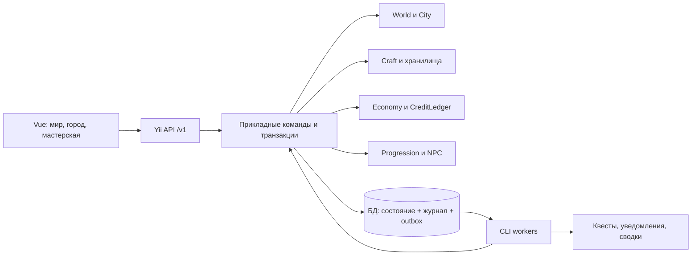

# Мир, градостроительство и крафт: архитектура развития

Дата: 2026-09-26. Статус: проект архитектуры и основание для планов реализации.

Основание: [ТЗ world.md](tz/world.md), поручение владельца о приоритете существующей игры и интеграции крафта с постройками. Изучена рабочая версия backend `07310d0`, frontend `8c96443`, включая последующие локальные изменения ТЗ. Этот документ описывает целевую систему; наличие таблицы или маршрута в нём не означает, что они уже реализованы.

Планы: [backend](plan/2026-09-26-world-backend.md), [БД](plan/2026-09-26-world-database.md), [frontend](../../frontend/docs/plan/2026-09-26-world-frontend.md). Контракты: [world-api.md](world-api.md). Для межрепозиторных ссылок предполагается соседнее размещение `back` и `frontend`.

Дополнение владельца от 26.09: [старт игрока, ночлег, улица, бюджеты и расширения](world-gameplay-economy.md). Оно уточняет этот проект: шалаш получают вручную один раз, станции сначала доступны на открытой площадке, защищённые помещения покупаются за Cr; доходные сущности имеют бюджет/казну, огород — 10 грядок с одной открытой. Казна собирается в собственный бюджет; отчисления из него идут в казну родителя. Несобранная казна подвержена разграблению. Прежнее допущение о бесплатной стройке S1 отменено.

Реализация нижнего уровня не вводит отдельный тип денег для стоянки. `BudgetGrants` работает с двумя `economy_subject`/budget по ID узлов: владелец может финансировать свой финансовый дочерний объект, физического потомка или свой огород из стартовой стоянки. При дальнейшем развитии поселений и регионов тот же путь использует опубликованную финансовую связь, резерв исходного бюджета и один `economy_transfer`; личный взнос остаётся отдельной операцией. Состояние болезни принадлежит персонажу и применяется одинаково независимо от места работы. Защита установленной вещи определяется `world_slot` и назначением комнаты через место ночлега; название/slug конкретной комнаты не является правилом. Продажа урожая использует конечный оплаченный заказ поселения и казну грядки, чтобы последующие сбор и отчисления проходили по общей финансовой иерархии.

## 1. Что действительно работает

| Область | Реализация и источник | Решение |
|---|---|---|
| Аккаунт и профиль | `user`, `persone`; [CreditLedger](../yii2/common/services/user/CreditLedger.php), [миграция persone](../yii2/console/migrations/m180511_155136_create_persone_table.php) | Существующий пользователь остаётся владельцем, `persone.credit` — единственным личным счётом Cr. `balance`, рейтинг, бонусы и авторизацию не переопределяем профессиями. |
| Каталог крафта | `craft_item/category/recipe/station`, ингредиенты, инструменты, зависимости, стабильные `code`; [CraftCatalog](../yii2/common/modules/craft/service/CraftCatalog.php), [seed](../yii2/common/modules/craft/data/default-catalog.php) | Один каталог для рюкзака, строительства, станций, производства и наград. Не создавать вторые `items/resources/recipes`. |
| Игровые команды | [Crafting](../yii2/common/modules/craft/service/Crafting.php): транзакция, `request_key`, fingerprint, лимит команд, журнал, блокировки каталога и владельца | Сохранить семантику повтора; выделять общие сервисы по мере подключения второго потребителя. |
| Прогресс крафта | `craft_skill`: опыт по категории, уровень `1 + floor(xp/100)`, предел 100; `craft_known`: изготовленные рецепты | Сохранить накопления и открытия. Пять профессий мира дополняют ремёсла, не заменяют их уровнями 1–10. |
| Рюкзак | [CraftStorage](../yii2/common/modules/craft/service/CraftStorage.php), [CraftInventory](../yii2/common/modules/craft/service/CraftInventory.php): 20–50 слотов, эликсир, переполнение, стопки, переносы | Сохранить ёмкость, линейную цену следующих постоянных слотов, истечение аренды без уничтожения предметов. |
| Сундук | `craft_container.id = craft_inventory.id`; содержимое через `container_id`, индивидуальная прочность, запрет вложенных сундуков | Размещается тот же сундук с тем же ID и содержимым. Местоположение отделяется от владения. |
| Починка | [ChestRepair](../yii2/common/modules/craft/service/ChestRepair.php): материалы из рецепта пропорционально повреждению, инструмент и станция изнашиваются | Сохранить формулу ремонта и красные причины нехватки. Текущий `craft_tool_wear(user_id,item_id)` общий для типа; для размещения нужен износ отдельного экземпляра. Обычное изготовление сейчас инструменты и станции не изнашивает. |
| Стоимость крафта | `charge_credits` в `craft_meta`, выключена по умолчанию | Мир не включает её скрытно. Цены строительства и производства — отдельные явно показываемые правила. |
| Снабжение | starter однократно, gather ежедневно по Europe/Moscow | Сохранить. Будущие месторождения — дополнительный источник, а не замена уже доступного сбора. |
| Город | [city store](../../frontend/project/src/store/city.js), [сохранение](../../frontend/project/src/services/city/mock.js): сетка 8×8, ратуша, дом, ферма, рынок, фабрика, парк, бюджет 500 в браузере, казна, население, рабочие места, события | Это локальная симуляция, серверного города нет. Сохранить понятные игровые действия и представление сетки; вынести демо отдельно при запуске серверного мира. |
| UI крафта | [classicCraft API](../../frontend/project/src/services/api/classicCraft.ts), [useClassicCraft](../../frontend/project/src/hooks/useClassicCraft.ts), `CraftSlotGrid`, `CraftInventory`, карта рецептов | Переиспользовать компоненты. Текущий парсер требует, чтобы каждый сундук присутствовал в рюкзаке; новый контракт размещения вводить отдельно. |
| Админка | Yii backend, RBAC, `p-admin`, POST/CSRF, предварительная проверка каталога и revision | Расширить действующую админку, использовать её модель проверки перед публикацией. SPA-админка не обязательна. |
| Фон и инфраструктура | Yii console/cron, Redis настроен как cache; отдельной игровой очереди в composer/config нет | Долговечные задания сначала хранить в БД и обрабатывать CLI. Redis не объявлять уже работающей очередью. |
| Другие механики | Игры, форум, подарки, переводы, обмен кредитов, финансовые истории | Сохранить; существующий exchange не является биржей предметов. Его деньги и права нельзя обходить новым городом. |

Некоторые старые планы и `docs/classic-craft.md` отстают от кода: там встречаются постоянная цена слота и отложенный ремонт. Для проектирования выше использованы актуальные сервисы, миграции и проверки, а не только отметки старых планов. В коде не обнаружены серверные модули мира, NPC или квестов.

## 2. Сопоставление с ТЗ и принятые изменения

| Разделы ТЗ | Принимаем | Адаптация к проекту |
|---|---|---|
| 1–5, 7, 22: дерево и навигация | Мир → регион → поселение → постройка/участок → комната; допустимые связи, координаты, крошки | Типизированные узлы и детали, без копирования всех предметов в `world_node`. Установленный предмет — проекция существующего инвентаря. |
| 6, 30–31: Composite/Visitor | Единый обход дерева, отдельные расчёты | Посетители читают пакетно загруженную модель и возвращают результат. Не делают скрытые платежи/запросы из каждого узла. Права и установка — отдельные policies, применяемые и к одному объекту без обхода мира. |
| 8–9, 23.2–3: здания, комнаты, установка | Совместимость, размеры, свободные слоты, состояние, уровень | Предметы и станции из `craft_*`; сохраняемые экземпляры вместо копий в `installed_items`. |
| 10–12, 24: работники и экономика | Серверные тики, содержание, производство, зарплаты, журналы | Cr вместо новой валюты «кристаллы»; городской счёт отделён от личного. Производство создаёт товар, а выручка появляется от оплаченной продажи/услуги. |
| 13, 25: события | Пожар, засуха, пандемия; противодействие, история, уведомления | События домена мира отделены от технических событий доставки. Первым каналом служит внутриигровой журнал; email/Telegram — последующие адаптеры с настройками. |
| 14–19: профессии и уровни | Пять направлений, условия, лимиты, серверный опыт | Ремесленные категории остаются отдельной шкалой 1–100. Для профессий данные допускают 1–10; стартовый контент 1–5. |
| 20–21: редактор, роли | Черновик, preview, публикация, аудит и откат контента | Расширяем Yii/RBAC. Откат контента не отменяет уже заработанные деньги, опыт или добытые вещи. |
| 23: API | Чтение дерева, команды, экономика, развитие | Используем принятую базу `/v1`, Bearer и серверную пагинацию. Старые `/v1/craft` и ключи повторов сохраняются. |
| 26: UI | Карта, страницы объектов, экономика, уровни, мобильный список | `/city` сохраняется как вход в серверный город; `/craft` — мастерская. Карта рецептов не заменяется географической картой. |
| 27–29: состав и готовность | 1 мир, 2 региона, 2 города, 2 деревни, 8 основных зданий, 6 комнат и 6 участков, 3 события | Это полный MVP по нескольким релизам. Первый работающий срез с домом и мастерской не объявляется завершением всего ТЗ. |
| Дополнение владельца | Квесты, развитие NPC, интеграция хранения | Включены отдельные домены и этапы; не моделируем NPC через фиктивные аккаунты. |

## 3. Границы системы

Модульный монолит Yii2 с одной транзакционной БД. Существующие `craft`, `exchange`, `games`, `forum`, `user` остаются на месте. Новые каталоги создаются внутри `common/modules`; общий транспорт/инфраструктура — в `common/services`, CLI — в `console/controllers`. До отдельного обновления runtime новый код совместим с PHP 7.3. Ни микросервисы, ни переписывание приложения не являются условием запуска мира.

| Домен | Владеет | Использует через явный интерфейс |
|---|---|---|
| world | Иерархия, координаты, собственность узлов, просмотр, места строительства | Проверка пользователя/RBAC, read-проекции city |
| city | Здания, комнаты, участки, проекты строительства, места установки, состояние | WorldRepository, InventoryService, RequirementEvaluator |
| craft | Каталог, рецепты, стопки, контейнеры, экземпляры оборудования, изготовление, ремонт | StationResolver, StorageAccessPolicy, существующий CreditLedger |
| economy | Городские счета, проводки, контракты, расчёт тика, задолженность, сводки | CreditLedger для личных Cr; InventoryService для товара |
| progression | Профессии, правила уровней, опыт, достижения, общая проверка требований | Адаптер к `craft_skill/known`, факты завершённых действий |
| npc | NPC, дом, занятость, состояние, профессиональные навыки, назначения | progression, задания производства, зарплатные правила |
| quests | Шаблоны, экземпляры квестов, цели, прогресс, выдача наград | Доменные события, inventory/economy/progression |
| world events | События и их область, модификаторы, действия противодействия | TreeQuery, city/economy/npc; размещается внутри world до обоснованного выделения |
| infrastructure | Команды, durable jobs, outbox/inbox, часы, аудит | Не содержит игровых формул |

### Иерархия и собственность

- Один опубликованный мир на старте; каждый узел имеет `root_id`, поэтому в будущем возможно несколько миров. Общий аккаунт и каталог не означают свободную перевозку предметов между мирами: переходы добавляются отдельным правилом.
- Начальная модель: общий мир и общие поселения; игрок владеет участками и зданиями. Смотреть город можно без доступа к чужим комнатам, сундукам и финансовым операциям. Регион/город по умолчанию управляется администрацией. Личный город позднее — тот же settlement с владельцем, без второй модели карты.
- `parent_id` — источник дерева; closure table ускоряет предков/потомков и пересчитывается той же транзакцией. Не хранить отдельные редактируемые `navigation_paths`. Глубина ограничена 32, перенос между корнями на старте запрещён.
- Допустимы world→region; region→settlement; settlement→building/plot; building→room/plot; plot→small building только при разрешении шаблона; garden plot→bed (грядка). Любая связь проверяет цикл, глубину и тип. Room не содержит room. Шалаш — временная building-проекция развёрнутого предмета на стартовой площадке, не второй независимый актив.
- Item, worker, event — ссылки в представлении узла, а не дополнительные родители дерева. NPC живёт в одном доме, работает в другом; событие региона влияет на много зданий. Такие связи нельзя выразить одним `parent_id`.
- Навигация пользователя — выбранный URL и необязательная закладка `last_node_id`. Это не физическое положение персонажа и не основание для прав. Передвижение/дальность — отдельная будущая механика.
- Фактическое место ночлега и класс защиты установленной станции — серверные назначения с периодом действия; смена URL их не меняет. Стартовый набор/ночлег/износ и состав бюджета описаны в дополнении.

## 4. Предмет, хранилище, экземпляр, установка

Различаем тип (`craft_item`), стопку (`craft_inventory`), физический экземпляр оборудования (`craft_equipment_instance`) и место хранения (`craft_storage`). `craft_container` сохраняет внутренний объём сундука и его прочность. `world_slot` описывает место установки внутри хранилища комнаты/постройки. Не создаём второй предмет при установке.

Целевая модель хранилищ:

| kind | Смысл | Ограничения |
|---|---|---|
| backpack | Рюкзак игрока | Текущие 20–50 активных ячеек, аренда и overflow |
| chest | Внутреннее содержимое конкретного сундука | Ссылка на существующий inventory ID сундука; вложенные сундуки запрещены |
| placement | Места установки комнаты, здания или открытой площадки/участка | По одной вещи в месте, проверка `world_slot`, класс защиты outdoor/covered/indoor; вместимость не относится к рюкзаку |
| stockpile | Вход/выход производства или склад здания | Раздельные позиции/ёмкости; явные разрешения на расход |
| recovery | Возврат вещей при аварии/административном изменении | Только забирать, нельзя использовать как бесплатный склад для обычных переносов |
| npc_equipment | Экипировка NPC, последующий этап | Назначение не передаёт право собственности; один экземпляр не используется двумя NPC |

Только inventory row определяет текущее `storage_id` и позицию. Список установленных вещей получается соединением placement storage с `world_slot`; отдельная таблица `installed_items`, копирующая состояние, не нужна. `user_id/container_id` старого инвентаря сохраняются на переходный период как совместимые поля, изменяемые тем же единственным writer; после переключения читается каноническое место, а не две конкурирующие версии.

Текущий каталог складывает инструменты и станции по 10. Это сохраняется: одна inventory row может содержать несколько equipment instances, число активных экземпляров равно quantity. При установке выбранная единица отделяется от стопки в row с quantity=1; её `instance_id` и прочность не меняются. При обратном объединении меняется только ссылка экземпляра на стопку. Таким образом миграция не превращает рюкзак из десяти стопок в сотню занятых ячеек.

ID сундука и `instance_id` оборудования не переиспользуются для новой вещи после уничтожения. Архивный equipment instance сохраняет item_id, но освобождает ссылку на стопку; новая единица получает новый instance ID. Текущий `CraftStorage::move()` повторно использует пустые rows: для rows, бывших сундуками, повторное использование запрещается, а для обычных стопок увеличивается revision. Новая команда не может попасть в другое содержимое по старому preview.

### Станции

- Станция каталога (`craft_station`) описывает возможность крафта. Физическая станция — `craft_equipment_instance` с собственной прочностью, ссылающийся на inventory row. Для установки из пачки выбирается один экземпляр; исходное количество уменьшается ровно на один, остаток и полный учёт сохраняются. У установленной станции своя row с quantity=1.
- `StationResolver` возвращает конкретный источник: переносная станция рюкзака, установленный экземпляр в выбранной мастерской или явно доступная общественная станция. Права проверяются на здание и использование оборудования, а не только на знание ID.
- Legacy-команда без instance_id выбирает доступный экземпляр детерминированно по позиции стопки и instance ID; расход/merge/transfer также перемещает или погашает соответствующие единицы. Новый preview фиксирует точный instance_id. Зарезервированная единица исключается из доступного количества даже в старом endpoint.
- До включения мирового режима сохраняется крафт с переносными станциями. В мировом режиме станцию необходимо разместить на стартовой площадке/участке либо в купленной комнате; это проверяет и legacy endpoint. Сложенный предмет хранится без погодного износа, но не работает. Выбор контекста даёт только доступные установки, не все станции мира; переход включается вместе с новым UI, без заднего начисления износа.
- Материалы по умолчанию берутся из рюкзака. Использование сундуков этой постройки требует явного выбора источников; сервер возвращает фактический план списания. Чужие, закрытые и недоступные хранилища не включаются в суммы.
- Базовый износ починки сундука — 1 у выбранного инструмента/станции; рабочий износ станции учитывает коэффициент и добавку среды на партию. Один экземпляр, удовлетворяющий двум требованиям, учитывается один раз. Базовая норма обычного крафта 0 сохраняется indoor; в мировом режиме наружная работа имеет явно настроенную добавку и пассивный износ по времени/погоде. Нормы outdoor/covered/indoor версионированы, preview ограничивает партии прочностью, перенос сохраняет интервалы и дробный остаток.
- Для размещённой станции при нулевой прочности слот остаётся занят сломанным оборудованием; его можно ремонтировать или забрать. Не удалять автоматически тяжёлую станцию из здания. Для переносного инструмента сохраняется нынешнее расходование изношенной единицы; обе политики явно заданы в каталоге.
- Перенос, установка и снятие никогда не восстанавливают прочность. При миграции старый износ переносится на одну детерминированно выбранную единицу этого типа, а не на все копии и не обнуляется (алгоритм в плане БД).

### Сундук в доме

1. Игрок создаёт сундук по текущему рецепту и дом с местом `STORAGE`.
2. Предпросмотр показывает выбранный сундук, содержимое, прочность, совместимость и получаемый свободный слот рюкзака.
3. Транзакция перемещает существующую row в placement storage. `craft_container.id` и дочерние inventory IDs сохраняются.
4. Сундук открывается из дома или из списка доступных хранилищ. Содержимое не становится общедоступным из-за видимости дома.
5. Заполненный сундук можно установить/снять целиком; нужна одна активная ячейка назначения. В другой сундук помещать его нельзя. Перемещение самого сундука не считается помещением содержимого и не расходует прочность.
6. Существующая норма износа за помещение предметов внутрь сохраняется. При нулевой прочности запрещается новое помещение, но разрешается извлечение и ремонт.
7. Снос/передача здания с вещами, жильцами, заданиями или долгами блокируется с перечнем причин. Аварийное разрушение сохраняет руины и доступ владельца к извлечению; после принудительного удаления вещи попадают в recovery с аудитом, не пропадают.

### Атомарная установка

`InstallItem` проверяет ключ повтора, владельца, revision источника/назначения, статус здания, совместимость и свободное место; блокирует необходимые строки; перемещает предмет; пишет историю и outbox; фиксирует результат команды одной транзакцией. Сбой любой записи откатывает всё. Повтор возвращает тот же результат без второго предмета. Одновременная установка в одно место даёт одного победителя и конфликт второму.

## 5. Команды, блокировки и события

- HTTP-контроллер вызывает прикладной use case. Тот открывает одну транзакцию; вложенные inventory/ledger/placement сервисы её используют и не делают самостоятельный commit.
- На переходном этапе единый порядок: `craft_meta` → строки владельцев `persone` по user ID → счета/корень операции мира → узлы по ID → storage по ID → inventory/экземпляры по ID → назначения/задания. Точные таблицы и повторный lock должны следовать этому порядку во всех путях, включая cron и админку. Доступ к старым craft writers остаётся под старой общей блокировкой до их миграции.
- Глобальную блокировку `craft_meta` позже заменяет неизменяемая версия каталога и проверка revision. Нельзя сначала убрать её только в новом коде: это создаст гонку с импортом/старым крафтом. Изменение — отдельный этап с конкурентными тестами.
- Отдельно учитывается текущая очистка заброшенных регистраций: `UserClearService` блокирует user → persone и проверяет связанные FK. Новые операции не должны после lock persone запрашивать lock user в обратном порядке. Новый owner_user_id всегда имеет реальный FK; onboarding и cleanup проверяются на конкурентное выполнение, чтобы не опираться только на распознавание имени колонки.
- Общая инфраструктура `game_command` обслуживает новые команды. Старый `craft_command` и его fingerprint остаются читаемыми для незавершённых клиентских повторов. Для новых команд сохраняются тип, версия контракта, canonical payload hash, actor, correlation ID и результат.
- `game_outbox` пишется вместе с изменением. Доставка как минимум один раз; каждый обработчик имеет уникальный `(consumer,event_id)` в inbox. Обновление прогресса и отметка inbox — одна транзакция.
- Критичные проверки, расход вещей, денег и выдача основного результата выполняются синхронно. Квестовые проекции, уведомления и отчёты допускают задержку. Клиент не присылает факт «квест выполнен» или «опыт получен».
- События содержат ID факта, type/version, actor/owner, world/node, operation ID, время и минимум необходимых данных. Примеры: `BuildingCompleted`, `ItemInstalled`, `ItemCrafted`, `ChestRepaired`, `ProductionCompleted`, `TradeSettled`, `NpcTrained`, `WorldEventResolved`.
- Историю экономики не восстанавливаем повторным исполнением outbox. Outbox — доставка фактов; финансовый ledger — источник проводок. Полный event sourcing не вводится.

## 6. Экономика и фоновые расчёты

### Деньги

Личные Cr остаются в `persone.credit`; отдельного `character.balance` нет. Каждый доходный объект, включая огород/грядку, имеет бюджет расходов и казну поступлений. Перевод личные Cr→бюджет, ручной сбор казна→собственный бюджет и выплата бюджет ребёнка→казна родителя — разные команды с проводками и `CreditLedger`. Родитель затем сам собирает свою казну; автоматического сбора при тике/посещении нет. Несобранные поступления теряют Cr от разграбления по сроку/ставке, уже собранный бюджет защищён от этой механики. Права, обязательства, возраст поступлений и защита целевых взносов — в [дополнении](world-gameplay-economy.md). Внутреннее движение не считается новой выручкой. Локальные 500 единиц города не конвертируются.

Новые расчёты используют фиксированную точность 4 знака после запятой, денежные DTO — decimal strings. Диапазон ограничивается безопасным масштабированным int64. Текущие поля `persone` созданы как double, а `CreditLedger` принимает float; до включения дробных городских платежей необходим отдельный проверенный переход к точным суммам и совместимый метод ledger. Нельзя объявить проблему решённой только `round()` в симуляторе. Старые ставки/переводы проверяются на копии данных; несовместимые исторические значения выносятся в отчёт, не округляются молча.

Производство не печатает деньги: материалы превращаются в предметы. Продажа/услуга создаёт Cr только через контрагента с ограниченным бюджетом либо явно настроенную эмиссию. NPC-заказы не являются P2P-биржей. Существующий обмен кредитов продолжает работать отдельно. Налоги, зарплата, содержание, субсидии имеют отдельные причины и контрагентов. Двойная запись внутри нового ledger проверяет нулевую сумму операции; личная сторона проводится через существующий ledger и связана с `history_balance`.

### Тик и задания

- Рабочее допущение для тестового баланса: один игровой день = 1 реальный час; 15 минут сравниваются нагрузочным тестом. Финальное значение публикуется вместе с версией правил. Истёкший период не пересчитывается новым размером тика.
- `world_tick(world_id, sequence, scheduled_at, rules_version, status)` и отдельные единицы расчёта по зданию/периоду. Уникальные ключи исключают повторную оплату после рестарта.
- Порядок периода: фиксируется версия правил и активных событий → изменения состояния/строительства на границе → население и доступность работников → резервы и производство → зарплата/содержание/налоги → снимок и уведомления. Эффект, начавшийся посреди периода, действует с ближайшей границы; ручная команда повреждения блокирует новые операции сразу. Эта семантика проверяется тестом.
- Строительство использует `finish_at` и сохраняемый прогресс/паузу; приобретение защищённых помещений и расширений требует Cr уже в S1. Ночь/болезнь, погодный износ и разграбление несобранной казны запускаются отдельными durable jobs на общем календаре, без зависимости от NPC/полного экономического тика. Ручной крафт остаётся мгновенным. Длительные задания производства — отдельный новый режим здания; его появление не включает ранее отложенную очередь ручного крафта.
- Worker берёт задание с lease и fencing token, продлевает lease либо освобождает после commit. Повтор захвата не даёт старому worker права записать результат. На старте возможен один worker с условным атомарным claim; `SKIP LOCKED` — только после проверки поддерживаемых версий БД.
- Нет одной транзакции на весь мир. Выполнение разбито на ограниченные партии; прогресс тика хранится. UI видит `processing/complete` и время завершённого снимка. Частичный тик не публикуется как полный отчёт.
- Догоняющие тики после простоя выполняются в хронологическом порядке с лимитом работы за запуск, без тихого пропуска дней. Перевод в обслуживание при большом backlog виден администратору. GET не начисляет доход и не продвигает стройку.
- Временная согласованность задаётся через `settled_through_tick` объекта и сохранённые состояния начала периода. Если влияющая на экономику команда пришла к объекту с незакрытыми прошлыми периодами, API ставит задачу догоняющего расчёта и возвращает `simulation_catching_up`; клиент повторяет после завершения, без расчёта дохода внутри HTTP. Изменение текущего периода имеет `effective_from_tick` для экономики, хотя ручная установка/использование доступно сразу по своим правилам. Новая станция не производит товар за время до установки; уже зарезервированное оборудование/сырьё защищено от переноса и ручного расхода. Worker сохраняет начальное состояние/резервы периода до его исполнения, а не восстанавливает прошлое из сегодняшнего mutable state.
- Не хватает входных ресурсов, работников, места выхода или оплаты — задание не производит результат; показана причина. Резервирование не допускает расход одних материалов вручную и NPC. Переполненный выход не уничтожает продукцию и не даёт забрать награду дважды.
- Зарплатные долги/долги содержания хранятся отдельно; доступный баланс не уходит в минус. Долг начисляется один раз за период, может приостановить производство и ухудшать здание, но не удаляет имущество автоматически.

Прогноз использует те же чистые функции, что и worker, без записи и без гарантии будущих цен/событий. Сводки по региону и миру агрегируют реальные нижележащие операции; внутренние переводы между городами показывают оборот, но не удваивают доход мира.

## 7. Персонаж, NPC, требования и квесты

### Развитие

`game_actor` связывает игровые действия с player или npc. Для player есть уникальная ссылка на существующий `user.id`, без нового логина, кошелька или копии профиля. NPC имеет отдельные имя, шаблон, владельца/нанимателя, дом, состояние и назначение. Каталог профессий общий, значения опыта каждого actor самостоятельные. Множество обычных жителей учитывается агрегатами населения, а именованные работники — NPC; один житель не считается одновременно свободным в агрегате и назначенным NPC.

Пять профессий мира — merchant, builder, gatherer, hunter, specialist. Ремёсла wood/metal/etc сохраняют `craft_skill`; адаптер показывает их рядом и позволяет правилам ссылаться на текущий опыт. Нельзя конвертировать старый xp 1:1 в другую шкалу или закрыть существующие рецепты новыми требованиями без отдельного изменения баланса. Hunter имеет данные и страницу, но боёвка не входит в MVP; опыт может даваться подготовленными квестами/экспедициями последующего контента.

`RequirementEvaluator` выполняет ограниченный набор декларативных условий: all/any, профессия, craft category level, известный рецепт, завершённый квест, репутация, владение, статус/уровень здания, количество ресурсов. Нет произвольного PHP/SQL/JavaScript в правиле. Версии правил неизменяемы после публикации; ответ содержит `code`, needed/have, причину и ссылку на способ достижения. Одни и те же predicates используются командами и страницами `/character/limits`, `/character/levels`.

Начисление опыта привязано к уникальному завершённому действию и получателю. Установка/снятие одного станка не образует бесконечный источник XP. Для повторяемых действий задаются дневной предел/затухание в контенте. Требования уровня могут включать опыт и достижения; достижение XP-порога не обходит обязательный квест. Персонаж получает награду за своё действие, NPC — за выполненную им работу, а не оба автоматически в полном размере.

### NPC

NPC имеет отдельный жизненный цикл найма, назначения, обучения и увольнения. На старте один активный рабочий пост; позже расписания. Назначение проверяет профессию, уровень, доступное рабочее место, состояние, жильё и бюджет оплаты. Изменение/отзыв назначения вступает в силу на определённой границе периода; уже зарезервированное задание завершается или отменяется по правилам с освобождением резервов.

Навык увеличивается только за завершённую работу/оплаченное обучение. Обучение фиксирует цену, длительность, преподавателя/станцию, версию программы; повтор не даёт второй XP. Здоровье, настроение, усталость и специализации — расширения факторов эффективности, а не ещё одна система баланса. NPC не исполняет произвольные действия под токеном хозяина; worker использует actor и явную доверенность на конкретный процесс.

### Квесты

Шаблон квеста версионирован, принятие создаёт экземпляр с зафиксированными целями и наградами. Цели описывают счётчик событий, владение/доставку ресурса, строительство, обучение NPC или разрешение события. Для каждой цели явно задаются retroactive/current-state/from-acceptance и допустимые actor/owner: соседский крафт или прошлое событие не закрывают задание случайно.

Состояния: available → accepted → ready_to_claim → claimed, отдельно expired/abandoned. Прогресс из событий идемпотентен. `claim` повторно проверяет условия, расходует сдаваемые предметы и выдаёт вещи/Cr/XP одной транзакцией. Если рюкзак полон — награда остаётся доступной, ничего не списывается; альтернативная выдача в recovery возможна только явным правилом награды. Reward не генерирует повторно событие сдачи того же квеста. Цепочки и обязательные prerequisites проверяются на цикл перед публикацией.

Первый сквозной квест: вступить в мир → получить и поставить шалаш → назначить ночлег → разместить верстак на улице → вложить Cr и купить защищённую мастерскую → перенести станцию/сундук → открыть следующую грядку → назначить NPC → выполнить оплаченный заказ → собрать доход по иерархии. Это одновременно проверка связности архитектуры; шаги ввода NPC/доходов добавляются после S1.

Первая защищённая мастерская может быть купленной комнатой в доме; бесплатный старт ограничен шалашом и наружным местом использования. Она не должна требовать награды за квест, для которого сама необходима. Проверка графа открытий охватывает вместе recipe dependencies, профессии, здания, доступный источник Cr и quest prerequisites; одного отсутствия циклов внутри списка квестов недостаточно. Onboarding проверяется с новым аккаунтом, конечными ресурсами и легальным путём заработать на первое помещение.

## 8. Контент, события, доступ и эксплуатация

Новый контент хранится шаблонами со стабильными `code` и опубликованными revisions. Существующий каталог расширяется совместимым экспортом/импортом, сохраняя поддержку version 1. Draft→review→published выполняется с preview: изменения цен, совместимости, вместимости, требований и список затронутых объектов. Публикация, перенос узла и ручная коррекция имущества записываются с автором и причиной. Роли world editor/economist дополняют действующий RBAC; по умолчанию права закрыты.

Снижение вместимости не удаляет занятые места; они переходят в режим извлечения. Изменение совместимости не выбрасывает уже установленный предмет: помечает его legacy placement, запрещает повторную установку и позволяет безопасно снять. Откат шаблона создаёт следующую revision. Исправление игровых последствий — отдельная компенсирующая операция с аудитом, никогда удаление истории.

Событие хранит scope node, период, seed, severity, версию эффекта. Идемпотентный EventImpact рассчитывает влияние по closure: пожар ограничен поселением, засуха регионом, пандемия миром. Правило суммирования нескольких эффектов явное, ограничено пределами, порядок детерминирован. Завершение снимает временные модификаторы, но не «лечит» уже нанесённые повреждения и не возвращает потраченные деньги.

Наблюдаемость: длительность/отставание тика, lease retry, dead letters, глубина outbox, конфликты команд, длительность locks, сверка инвентаря и денег, долги, недоступные станции. Логи содержат correlation ID, не токены. Персональные склады/балансы фильтруются до пагинации и агрегации; кеш общего города не включает частный сундук. Уведомления не отправляются внешними каналами до их подключения и пользовательских настроек.

## 9. Этапы выпуска и критерии перехода

| Этап | Проверяемый результат | Входит |
|---|---|---|
| S0 — подготовка | Зафиксированы контракты и миграционный отчёт, существующий крафт проходит регрессию | DB A, BE A1–A3, FE A1–A2 |
| S1 — старт, вещи и покупки | Шалаш/ночлег → наружная станция → вложение Cr → купленная комната/сундук; огород 1/10 и покупка грядок | DB B–D, ранний E1, F1–F3 и I–J; BE A4–A6, B–D, ранние E1/F1–F2 и K–M; FE A3–A5, B–C и H–J. Сбор и отчисления действуют в S1; полное производство и урожай из новых групп подключаются в S2. |
| S2 — производство | NPC выполняет производственный заказ, деньги/предметы/зарплата не дублируются после рестарта | Actor/professions, NPC, reservations, tick, ledger; DB E–F, BE E–F, FE D |
| S3 — полный MVP | Контент §27, 3 события, квест, 5 профессий, лимиты/условия, отчёт экономики, публикация/откат | DB G–H, BE G–H, FE E–F |
| S4 — развитие | Независимые контентные и технические расширения | P2P торговля, транспорт, несколько миров, сложные специализации NPC, бои, внешние уведомления |

S1 требует точного денежного ядра, бюджетов/казны, ручного сбора/отчислений, приобретения помещений за Cr и работоспособных night/wear/treasury-loss jobs; production tick NPC ещё не нужен. Реальные покупки не открываются до готовности ledger и сверки. Полный MVP включает все критерии §29 и новые правила старта/иерархии бюджетов, а не только S1.

Контент сохраняет ратушу, дом, ферму, рынок, фабрику, парк как знакомые типы, добавляет кузницу, лавку, склад, таверну, клуб, больницу, пожарную станцию, шалаш, огород/грядку и навес. Существующие верстак, плавильня, наковальня, алхимический стол и сундук используются повторно. Новые кровать, прилавок, насос, ирригация, пожарный инвентарь, медицинский шкаф, производственный станок добавляются к тому же каталогу. «Печь» из ТЗ либо отдельный бытовой предмет, либо понятное название плавильни в производственном контексте; два одинаковых рецепта без различий не создавать.

## 10. Допущения, которые можно менять без переделки ядра

Для планирования приняты: общий мир с личной недвижимостью; одна валюта Cr; бесплатная навигация без физического пути; материалы только из явно выбранных хранилищ; один активный пост NPC; часовой игровой день; отсутствие P2P и боёв в MVP. Шалаш отсутствует до разового получения по кнопке; стартовая площадка — право пользования, сырьё — уже существующий craft starter. Автоматическая бесплатная выдача собственности/помещений и повторный сброс стартовых наград не предусмотрены.

До публикации экономического контента требуется зафиксировать цены первой комнаты/огорода, base price расширений, нормы ночлега/болезни/износа, ставки распределения, нормы потребления/зарплат и длительность дня. Примеры из дополнения являются настройкой тестового стенда, не утверждёнными ценами. Огород имеет ровно 10 грядок с одной доступной по поручению владельца; для остальных объектов лимиты задаёт шаблон.

Исходное ТЗ сохранено без изменений. Старые планы крафта не выполняются повторно; новые планы ссылаются на актуальные реализации и отмечают собственные ещё не реализованные шаги. Документация сама по себе не запускает миграции, не переносит локальные города и не меняет рабочий сервер.
