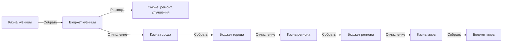

# Старт игрока, условия жизни и бюджеты мира

Дата: 2026-09-26. Дополнение по прямому поручению владельца к [архитектуре](world-architecture.md) и [ТЗ](tz/world.md). Это проект правил для реализации; цены и коэффициенты, обозначенные как пример, не утверждены как игровой баланс.

Планы: [BE](plan/2026-09-26-world-backend.md), [DB](plan/2026-09-26-world-database.md), [FE](../../frontend/docs/plan/2026-09-26-world-frontend.md), [API](world-api.md).

## 1. Что изменяется относительно первого проекта

В стартовом инвентаре нового пользователя вещи автоматически не появляются. Игрок сам один раз получает шалаш, назначает место ночлега и начинает с открытой площадки. Производственное помещение приобретается за Cr. Улица разрешена для станций, но увеличивает износ. Все покупки, содержание, лечение, услуги, улучшения и поступления мира используют Cr и единый журнал операций. Существующий бесплатный starter сырья и настройка `charge_credits` крафта сохраняются как явно заданные бесплатные механики; новая экономика не создаёт отдельную условную валюту.

У всех приносящих доход сущностей есть бюджет и казна, в том числе у огорода и его грядок. Уточнённый владельцем цикл: поступления → казна объекта → ручной сбор в бюджет того же объекта → расходы или отчисление в казну родителя. Несобранную казну постепенно разворовывают. В раннем S1 уже нужны реальные покупки, счета и переводы; откладывать всё денежное ядро до NPC нельзя. Уточнение заменяет прежнее допущение S1 о бесплатной стройке только из материалов.

## 2. Начальный набор и шалаш

| Объект | Что доступно при создании аккаунта | Что создаётся после действия |
|---|---|---|
| Шалаш `world-starter-shelter` | Право на разовое получение; предмет отсутствует | Один экземпляр шалаша в рюкзаке либо явно выбранное размещение на стартовой площадке |
| Стартовые материалы крафта | Существующая доступность `/craft` starter | Текущий набор сырья по каталогу, без повторной выдачи в наборе мира |
| Стартовая площадка | Предложение вступить в мир | Одно личное право использования небольшого места в стартовом поселении: шалаш + базовое наружное место станции |
| Станция | Текущие рецепты и имеющееся оборудование | Игрок изготавливает/покупает станцию; бесплатный второй верстак автоматически не выдаётся |
| Комнаты, дом, огород | Каталог и серверные цены | Собственность/доступ только после принятой покупки за Cr |

Шалаш — предмет общего каталога с собственным экземпляром, прочностью и одним местом для ночлега, а не бесплатная капитальная постройка. Развёрнутый шалаш представлен временной постройкой, связанной с тем же item instance; сложенный предмет и действующая постройка не существуют одновременно. Снятие сохраняет повреждение и прекращает покрытие будущих ночей. Шалаш не имеет производственных комнат, не защищает промышленное оборудование от погоды и не заменяет покупку мастерской.

Получение оформляется серверной командой с уникальным `(user_id,grant_code)`. Изменение версии набора, перезагрузка, повтор запроса, перенос/продажа/утрата шалаша и вход в другой регион не дают повторной выдачи. Набор относится к аккаунту в активном мире; будущий новый мир не сбрасывает право автоматически. Существующие аккаунты получают такое же ещё не использованное право при первом вступлении, а не автоматическое имущество. Новый набор отделён от craft starter, поэтому ранее получивший сырьё игрок не теряет шалаш.

Содержимое набора задаётся версией каталога; обязательный первоначальный предмет — один шалаш. Дополнительные стартовые предметы можно добавлять позже через отдельное явно названное право/компенсацию, не переоткрывая старый grant. Если рюкзак заполнен и место размещения не выбрано, получение отклоняется без погашения права. Выдача и развёртывание напрямую в лагере выполняются атомарно и показываются отдельным вариантом preview.

Стартовая площадка даёт право пользования, не перепродаваемую землю. Её нельзя сбрасывать ради новой бесплатной грядки, денег или шалаша. Площадку можно освободить после переезда; право получения набора при этом остаётся погашенным.

## 3. Ночлег, болезнь и восстановление

Состояние относится к `game_actor`: персонаж игрока или NPC. Для регистрации без вступления в мир ночи не начисляются. При вступлении фиксируется `joined_world_at`, выдаётся понятное предупреждение и один полный игровой день для обустройства; далее действует серверный календарь мира, независимо от открытой вкладки. Продолжительность дня и ночной интервал — версия правил; сервер отдаёт ближайшие границы, клиент не угадывает часовой пояс/полночь.

Место ночлега назначается заранее и сохраняется: персонаж автоматически использует его каждую ночь, в том числе офлайн. Сервер проверяет доступ, исправность укрытия, вместимость и покрытие ночного интервала. Один человек не занимает два места, одно место не обслуживает двух жильцов в одну ночь. NPC, работающий в ночную смену, имеет отдельное разрешённое окно отдыха; будущие расписания расширяют это правило.

Ночь без укрытия увеличивает `exposure_nights`; первая незащищённая ночь после льготного периода вызывает лёгкую болезнь, повторные ухудшают состояние до заданного предела. Болезнь снижает работоспособность и восстановление, но не отнимает вещи/Cr напрямую и не удаляет персонажа. Начальные коэффициенты для стенда: лёгкая болезнь — эффективность 0.8, тяжёлая — 0.5; точные стадии/порог публикуются в балансе. Качество шалаш/дом, отопление, погода и медицинская помощь — самостоятельные ограниченные модификаторы.

Выздоровление возможно за несколько защищённых ночей; лекарства/больница ускоряют его за материалы или Cr по preview. Это оставляет путь восстановления при нулевом балансе. Назначение места не лечит уже полученную болезнь мгновенно. У болезни есть `onset`, severity, recovery progress и processed night; job с ключом `(actor_id,night_id)` обрабатывается ровно один раз. Поздний worker проверяет историю размещения/проживания за нужную ночь, а не текущее наличие шалаша в момент входа.

В MVP не вводятся смерть и необратимая потеря имущества за отсутствие в игре. Фоновый расчёт ограничивает severity, но не пропускает ночи молча. Снос/складывание занятого укрытия требует переназначения жильцов или явного подтверждения будущей ночёвки без защиты; уже прошедшая ночь не переписывается. Форум, существующие игры и финансовые переводы не блокируются болезнью.

## 4. Станции на улице и покупка защиты

Место установки хранит класс защиты `outdoor`, `covered`, `indoor`, а также климат/состояние укрытия. Это свойство фактического места и опубликованного шаблона, не присланный клиентом коэффициент. Наружный верстак размещается на площадке/участке, наковальня — на допустимом основании; несовместимые опасные станки нельзя установить в жилой зоне. Шалаш защищает спящего персонажа, но его условная «крыша» не превращает соседний верстак в indoor.

| Воздействие | Outdoor | Covered, например купленный навес | Indoor, купленная подходящая комната |
|---|---|---|---|
| Износ за календарное время | Повышенный | Промежуточный | Базовый, вплоть до 0 для защищённого оборудования |
| Износ за работу | Норма × наружный коэффициент | Норма × коэффициент навеса | Обычная норма |
| Погодные события | Полное воздействие | Частичное по классу защиты | По устойчивости здания/комнаты |

Тестовый пример настройки, не окончательный баланс: пассивно 4/1/0 единиц прочности за игровой день, множитель рабочего износа 2/1/1 и дополнительный износ уличной работы 1/0/0 за партию. Формула `working_wear = batches × (base_wear × use_factor + exposure_use_wear)`. Текущая починка сундука имеет base_wear=1 и одну партию; обычный крафт сейчас base_wear=0, но в мировом режиме наружная станция получает явный дополнительный износ среды. Indoor сохраняет прежнюю базовую норму. Так постоянное складывание станка после каждой операции не делает уличную работу полностью бесплатной по прочности; уже накопленное время тоже сохраняется. В руках инструмент не получает пассивный погодный износ стационарной установки.

Preview ограничивает число партий доступной прочностью и показывает полный износ. При точном исчерпании операция заканчивается и оставляет broken instance; при нехватке прочности на всю партию команда отклоняется без частичного расхода/выдачи. Весь дополнительный мировой износ включается только с опубликованной версией новых правил и доступным UI, не меняет старые завершённые команды.

Износ учитывает интервалы реального размещения, смену погоды, версию правил и дробный остаток. Перед снятием/перестановкой фиксируется уже начисленный интервал под той же блокировкой экземпляра; нельзя переносить станцию каждую минуту и округлять каждый раз до нуля. Таймер не обнуляется при выходе, repair или смене владельца. При задолженности worker используется тот же catch-up gate, что и для экономики; GET только показывает проекцию.

Сложенную станцию можно хранить в рюкзаке без воздействия погоды, но для работы в мире её необходимо развернуть. После включения мирового режима legacy craft route использует ту же проверку размещения: нельзя получить бесплатную защиту работой «из рюкзака». До включения режима существующим игрокам сохраняется прежний крафт; переход публикуется вместе с доступной площадкой, UI размещения и новыми правилами, без ретроактивного износа.

Покупка помещения/навеса имеет Cr-цену, продавца/получателя и при необходимости строительные материалы/срок. Варианты: купить готовую мастерскую; купить подходящую комнату в своём здании; улучшить навес до полноценного помещения. Нельзя выдать бесплатную промышленную комнату через starter или привязку к шалашу. Уже купленное помещение не заменяет совместимость станка и пожарные ограничения. При нулевой прочности станция остаётся сломанным объектом, производство останавливается; покупка/перенос не ремонтирует её бесплатно.

## 5. Бюджет и казна каждой сущности

**Бюджет** — Cr, выделенные для покупок, содержания и развития этой сущности. **Казна** — накопленные реальные поступления, которые ещё не распределены. **Личный баланс** — существующий `persone.credit`; он не копируется в бюджет каждого объекта.

Обязательная пара счетов есть у каждого доходного объекта: мир, регион, город/деревня, кузница, рынок, клуб, огород, продуктивная грядка и другие шаблоны с `income_enabled`. Для остальных самостоятельных объектов модель допускает те же счета с нулевой казной, создаваемые лениво; доход не возникает от самого существования сундука или комнаты. Их приобретение/содержание может оплачиваться явно указанным бюджетом владельца-объекта. NPC с самостоятельной экономикой подключается через actor. Для персонажа budget account ссылается на существующий личный Cr; второго личного баланса нет. Каталоги, recipes и технические слоты не имеют самостоятельных счетов; стоимость единиц сырья учитывается в бюджете производства.

Вводится `economy_subject` с одним типизированным FK на node/actor/asset. Для каждой пары `(subject_id,role=budget|treasury,currency=Cr)` существует максимум один счёт. Финансовый получатель обычно совпадает с иерархией владений: бюджет грядки перечисляет в казну огорода, комнаты — здания, станции — мастерской, кузницы/рынка/клуба — города, города/деревни — региона, региона — мира. Перенос имущества не переписывает получателя уже начисленных обязательств.

Счета начинаются с нуля; само создание дома/грядки не создаёт Cr. Источники денег — личное вложение, платёж покупателя/арендатора/NPC, перечисление от ребёнка, целевая субсидия с указанным источником. Стоимость активов и расчётная урожайность не являются деньгами в казне.

### Направление сбора и движения денег

По уточнению владельца кнопка «Собрать» всегда переводит казну **в бюджет этого же объекта**. Движение на следующий уровень — другая команда «Выплатить отчисление»: бюджет ребёнка → казна родителя. Владелец города затем отдельно собирает городскую казну в бюджет города. Нельзя одним сбором кузницы одновременно зачислить одинаковые Cr кузнице, городу и региону.



У каждой казны на схеме есть собственные сроки разграбления; перевод в соответствующий бюджет прекращает этот риск для собранной суммы.

| Операция | Откуда → куда | Кто и при каких условиях |
|---|---|---|
| Вложить в развитие | Личный Cr → бюджет выбранного объекта | Владелец/управляющий либо разрешённый инвестор; операция не обещает автоматической доходности |
| Оплатить покупку/работу | Бюджет объекта → счёт продавца/исполнителя | Владелец/уполномоченный worker; только свободный остаток, не чужой бюджет |
| Получить выручку | Плательщик → казна получателя | Подтверждённая продажа/аренда/услуга; вещи и деньги обмениваются атомарно |
| Собрать | Казна объекта → бюджет того же объекта | Только владелец/управляющий; ручное действие, фиксирующее собираемую сумму |
| Выплатить отчисление | Бюджет ребёнка → казна финансового родителя | Владелец/управляющий ребёнка оплачивает конкретное обязательство с известной суммой и сроком |
| Финансировать дочерний объект | Бюджет родителя → бюджет ребёнка | Целевая проводка/субсидия с назначением; не повторная эмиссия |
| Возврат взноса | Свободный остаток целевого взноса → его исходный плательщик | Отдельное разрешённое действие с проверкой происхождения и резервов |
| Собрать на уровне мира | Казна мира → бюджет мира | То же действие, что на остальных уровнях; дальше обязательного родителя нет |

Один пользователь может владеть несколькими уровнями, но роли и счета остаются разными. Владелец города не собирает частную казну кузницы: он получает отчисление в городскую казну. Правила обязательных выплат публикуются при размещении/покупке объекта: получатель, процент/фиксированная сумма, база, период, срок и revision. Начальная база для процентных выплат — собранная выручка; целевые личные взносы/субсидии не облагаются повторно. Другие базы, например чистая прибыль, могут вводиться только явной версией правил. Конкретные ставки — настройка баланса.

Начисление обязательства при сборе и резерв в бюджете выполняются в той же транзакции: нельзя потратить обязательную долю на апгрейд, а потом заявить нулевой остаток. Выплата остаётся отдельным действием владельца. Просрочка создаёт видимый долг и предусмотренные правилами ограничения; новая ставка не пересчитывает старый invoice. Родитель может собирать только уже фактически полученные Cr, не обещанный долг.

«Собрать всё» фиксирует доступные остатки собственных объектов после уже наступивших потерь, а не запускает сбор всей иерархии автоматически. Повтор того же request_key не забирает новый доход. Массовое действие разбито на ограниченные идемпотентные партии с одним batch ID и видимым результатом по объектам. Никакой cron не собирает казну за игрока в базовой механике.

Пример без новых денег: в казне кузницы 100 Cr → владелец собирает 100 в бюджет кузницы → 60 тратит на сырьё/ремонт, 20 перечисляет в казну города, 20 сохраняет в бюджете кузницы. Город собирает свои 20 в бюджет города и по своему правилу перечисляет, например, 5 в казну региона. Регион собирает эти 5 и оплачивает своё отчисление в казну мира. Ставки в примере иллюстративны. Личный взнос 300 Cr на больницу — отдельное движение в её бюджет, не выручка и не основание повторного процента.

Вложения из личного баланса допускаются в любой доступный объект, включая огород или конкретную грядку. Произвольный вывод бюджета города/региона на личный счёт в базовом сценарии не предусмотрен. Возврат неиспользованного целевого взноса — отдельная проверяемая операция с источником, разрешением и отсутствием обязательств, а не кнопка обнуления казны.

### Разграбление несобранной казны

Потери касаются только Cr в казне. Личный баланс, уже собранный бюджет, предметы и резервированные бюджетные платежи этой механикой не затрагиваются. У каждого поступления фиксируются время и правило защиты; после льготного срока оно участвует в периодическом серверном расчёте разграбления. Срок, процент, предел и влияние охраны задаются шаблоном/уровнем объекта и версией баланса. Пример стенда: одни игровые сутки защиты, затем 5% оставшейся просроченной суммы за сутки; это не утверждённая ставка.

Новое поступление не продлевает защиту всей прежней казны. Частичный сбор списывает самые старые доступные поступления и не обновляет возраст остатка. Базовая операция собирает всё доступное, но её preview/result различают начислено, уже потеряно, зарезервировано и доступно к сбору. Факт посещения страницы/входа не защищает казну: защита достигается переводом в бюджет.

Расчёт одинаков при открытой вкладке и офлайн; уникальный `(treasury_id,loss_period)` не допускает повторного списания. Дробные остатки сохраняются, чтобы частые частичные сборы не меняли округление. При задержке worker сначала закрываются наступившие периоды потерь, затем выполняется сбор; снятие Cr перед запоздавшим job не отменяет уже наступившее разграбление. API использует catch-up gate и выдаёт обновлённый quote, а не рассчитывает всю экономику в GET.

Каждая потеря — проводка казна→системный счёт потерь с причиной, period и revision; этот счёт не доступен игрокам как бесплатный источник средств. Баланс не уходит ниже нуля, потери не создают дополнительный долг. NPC-воры, охрана, страховка и задания возврата могут расширить модель позже через те же события, но не создают второй выдачи украденной суммы. В S1 интерфейс показывает срок начала/следующего разграбления, ставку, оценку потерь и журнал; охрана/сейф как платные улучшения уменьшают риск по явно ограниченной формуле.

Изменение охраны/ставки действует с опубликованной границы следующего периода и сохраняется в истории защиты. Оно не возвращает старые потери и не применяет новую ставку ко всему прошлому при запоздавшем job. Для исторического расчёта используются receipt time, версия базового правила и действовавший в этом периоде уровень защиты.

Перечисление наверх начинает отдельный срок хранения в казне получателя. Из собственного бюджета нельзя произвольно гонять деньги обратно в казну ради смены возраста/налоговой базы. Сбор, собственные вложения и внутренние отчисления не дают торговый XP или повторные квестовые награды как новая продажа.

## 6. Огород и платное расширение

Огород приобретается как участок со своим бюджетом и казной. У него 10 постоянных дочерних грядок типа `BED`: первая включена в приобретение огорода, грядки 2–10 закрыты. Закрытая грядка видна с номером и ценой; не имеет урожая/дохода, не принимает посадку или NPC. «Первая бесплатна» означает отсутствие отдельной платы за первое место, а не бесплатный новый огород при каждом сбросе.

Для последовательных расширений используем общую формулу. Пусть `f` — изначально открытые места, `u` — уже открытые, `p=u-f` — число купленных, `B` — цена первого платного места. Тогда:

```text
Цена следующего места = B × (p + 1)
Стоимость q последовательных мест = B × q × (2p + q + 1) / 2
Условие: 1 ≤ q ≤ limit − u
```

Для огорода `f=1`, `limit=10`: грядки 2–10 стоят `B,2B,...,9B`; все девять — `45B`. Иллюстрация при B=10 Cr: 10,20,...,90, всего 450 Cr. Сервер отдаёт цены и total, клиент подтверждает полную сумму. Изменение base price/revision между preview и оплатой отклоняется; повтор не покупает следующую грядку ещё раз.

Покупка расходует **бюджет огорода**, предварительно пополняемый из личного Cr или родительского бюджета. Бюджет грядки используется для семян/воды/работника/содержания; огород может выделить ей средства. Допустима команда «внести недостающее и купить» только с явно показанными двумя проводками в одной транзакции. Скрытого списания личного счёта при пустом бюджете нет.

Грядка имеет культуру, почву, влажность, срок созревания и состояние; цикл empty→sown→growing→ready→harvested, при нарушениях paused/failed с причиной. Семена/вода/удобрения — предметы единого craft каталога. Сбор выдаёт предметы в выбранный доступный склад, а продажа создаёт доход в казне грядки. Сбор урожая сам не добавляет Cr. Двойной harvest/retry не выдаёт урожай дважды, полный склад не уничтожает уже выращенное.

Полив, работник, погода и качество почвы меняют производство; автополив/теплица покупаются и требуют ресурсы/содержание. Платёжные права на грядки постоянны: гибель урожая или продажа/передача участка их не обнуляет. После передачи новый владелец получает фактические открытые места и прежний счётчик; снос не создаёт обратный выкуп по новой цене. Долги и резервы закрываются до передачи.

## 7. Аналогичные объекты

| Сущность | Что открывается постепенно | Расходы и доходы | Казна получателя отчислений |
|---|---|---|---|
| Дом | Места ночлега, комнаты; базовое место включено в покупку | Содержание/ремонт/отопление, реальная аренда | Поселение |
| Мастерская/кузница | Места станций, рабочие посты, склад входа/выхода | Покупка комнаты/станка, сырьё, износ, зарплата; оплаченные заказы | Поселение |
| Огород | 1 из 10 грядок, затем места по возрастающей цене | Семена/полив/работники; продажа урожая | Поселение или здание, которому принадлежит участок |
| Ферма/сад | Грядки, загоны, деревья, теплицы по шаблону | Корм/вода/семена/ветеринария; продукция | Поселение |
| Рынок/лавка | Торговые места и объём склада | Содержание/закупки; фактическая маржа и комиссии с оплаченных сделок | Поселение |
| Клуб/таверна | Посадочные места, обслуживание, мероприятия | Зарплаты/снабжение; оплаченные посещения, влияние на настроение | Поселение |
| Склад | Секции хранения/ячейки по шаблону | Покупка расширений/содержание; оплаченная услуга хранения | Поселение/предприятие |
| Больница | Койки и медицинские посты | Персонал/медикаменты; оплата лечения или целевая субсидия | Поселение |
| Город/деревня | Участки, общественные места, инфраструктура | Дороги/защита/услуги/субсидии; отчисления объектов в собственную казну | Регион |
| Регион | Развитие поселений, связи и защита | Региональные программы; отчисления городов/деревень в собственную казну | Мир |
| Мир | Открытие новых регионов и глобальных программ | Общие программы/события; отчисления регионов в собственную казну | Нет родителя; сбор в собственный бюджет |

Универсальный `ExpansionPolicy` хранит scope, kind, initial_open, limit, base_price, curve и version. Огород всегда начинает с 1/10; другие пределы задаются конкретным шаблоном, а не копируются как «10» повсюду. Общие правила — последовательная покупка, серверный quote, постоянное право и растущая цена. Купленная рабочая позиция не создаёт бесплатного NPC, слот станка — бесплатного станка, торговое место — доход без покупателя.

## 8. Порядок реализации и приёмка дополнения

S1: точные Cr/пара счетов/ручной сбор/отчисления/разграбление и платное приобретение → разовое получение шалаша/ночлег → улица и износ → платная комната → огород 1/10 и покупка расширений. Ночь, погодный износ и разграбление работают собственными durable jobs на общих часах; для них не требуется запуск всей производственной экономики S2. Источник дохода S1 — опубликованные ограниченные оплаченные задания, доступные без купленной мастерской; награды идут в казну стартового хозяйства. S2 добавляет культуры/NPC/производство и полную иерархию доходных объектов. S3 связывает это с событиями, квестами и полной балансировкой.

Проверки: два одновременных claim дают один шалаш; болезнь определяется защищённостью конкретной ночи; перестановка не стирает wear; комнату нельзя получить бесплатно другим route; у огорода один первый слот и девять возрастающих цен; ошибка последней записи откатывает оплату/открытие; повтор harvest/collect/loss не создаёт ценности; цикл казна→свой бюджет→казна родителя сохраняет сумму Cr с учётом журналируемых потерь; целевые взносы не становятся налогооблагаемой выручкой; новый доход/частичный сбор не обновляет возраст старой казны; смена финансового родителя не присваивает старые обязательства.
